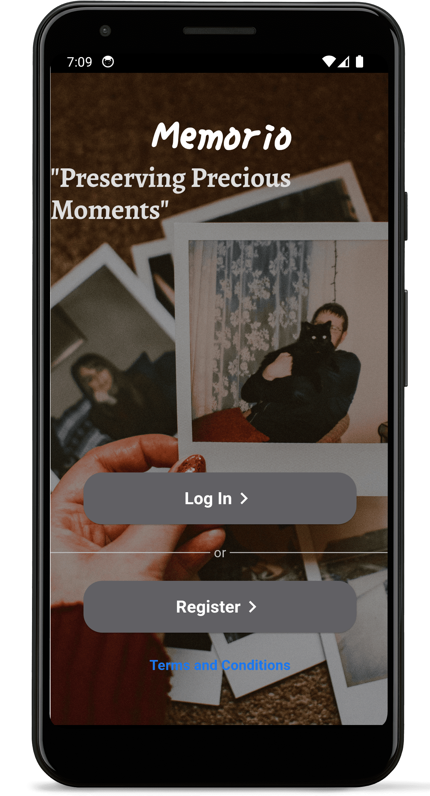
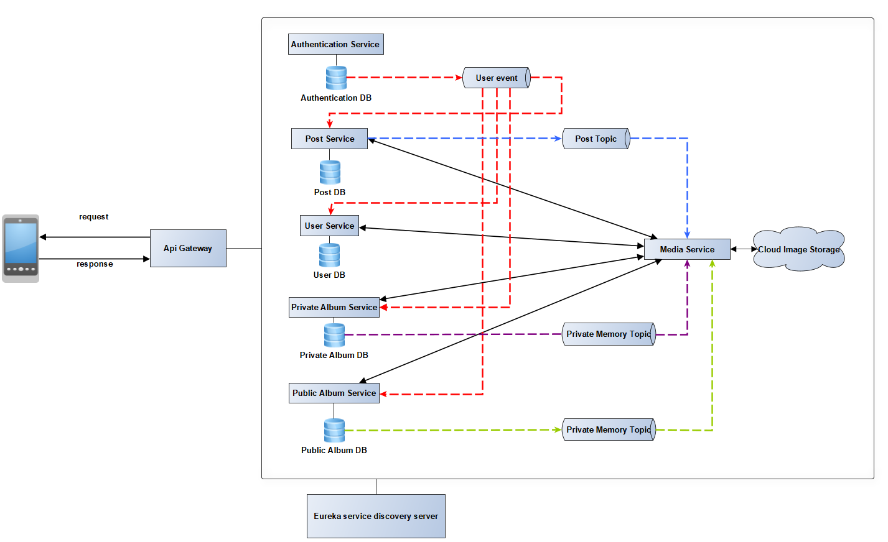

# Memorio - An application for sharing memories

> [!WARNING]
>  Due to the tight deadline this software is yet unfinished. Currently rewriting the Flutter frontend, and fixing the code quality on backend. 
> 

>  
> Please be aware that this project is currently in an unfinished state and may have incomplete features or issues. While we are actively working on it, there might be bugs, missing functionality, or unpolished areas. 
>   
> If you encounter any issues, have feedback, or want to provide tips or suggestions for improvement, we welcome your input. Feel free to reach out to us at `mellau.mark12@gmail.com` with your feedback and concerns. Your input will be greatly appreciated in helping us improve this project.
> 

Memorio is a social media-like application where users can create posts, follow other users, and check their posts. The main feature of Memorio is to enable users to create public and private shared galleries, where they can add other users and upload common memories like hiking trips and more.

## Features

- **User Registration and Authentication**: Sign up and log in to access the platform.
- **Create Posts**: Share your thoughts and experiences with your followers.
- **Follow Users**: Follow other users to see their posts in your feed.
- **Shared Galleries**: Create public and private galleries to share photos and memories with friends.
- **User Profiles**: View and edit your profile, and view other users' profiles.

## Screenshots and demo video link

  
  
  
  

### Demo video link (Google Drive): https://drive.google.com/file/d/1zj9dLYVvDHTiGa4Lkk7vVLXui7zm3-as/view?usp=sharing 

## Technical Details

### Microservice Architecture

Memorio is built using a microservice architecture, which allows for modularity, scalability, and maintainability. Each microservice is responsible for a specific business function and communicates with other microservices through well-defined APIs.

  - **User Service:** Handles user registration, authentication, and profile management.
  - **Post Service:** Manages the creation, retrieval, and deletion of posts.
  - **Public Album Service:** Facilitates the creation and management of shared galleries.
  - **Private Album Service** Sends notifications to users about relevant events (e.g., new followers, new posts in followed galleries).
  - **Authentication Service**
  - **Api Gateway**
  - **Discovery Server**
  - [...]

  

    
  

  

### Asynchronous Communication with Kafka

To ensure scalability and decoupled communication between microservices, Memorio uses Apache Kafka for asynchronous messaging. Kafka acts as a message broker that enables services to communicate without direct dependencies on each other.

**Event Producers:** Microservices that generate events (e.g., Post Service publishing a new post event).
**Event Consumers:** Microservices that consume events (e.g., Notification Service consuming new post events to send notifications).

**Reliable Message Transmission with Transactional Outbox Pattern and Debezium**

Memorio employs the transactional outbox pattern combined with Debezium to ensure reliable message transmission. This pattern helps avoid issues with distributed transactions and ensures that messages are not lost.

**Transactional Outbox Pattern:** Each microservice writes messages to an "outbox" table as part of its local transaction. This guarantees that the message is written only if the transaction is successful.
**Debezium:** An open-source distributed platform that captures row-level changes in databases and streams change events to Kafka. Debezium monitors the outbox table and publishes messages to Kafka topics.
